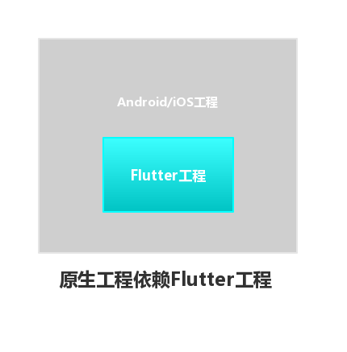
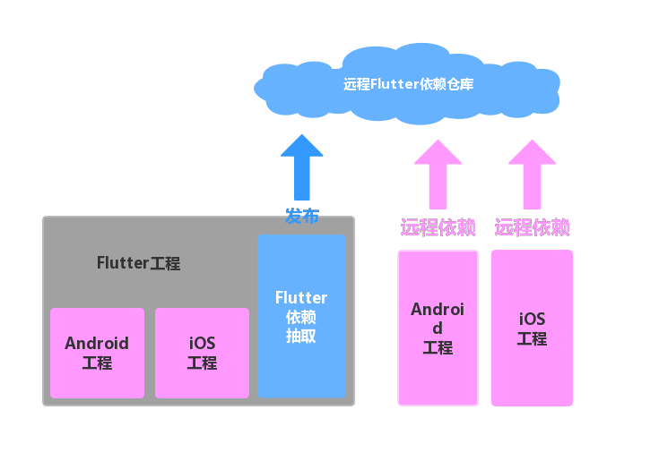
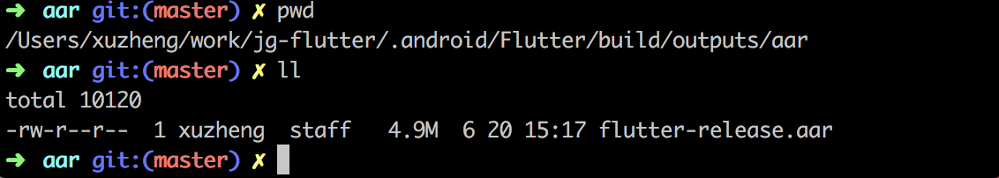

# Flutter持续集成实践


* 1、引言
* 2、Android实现
	* 2.1、Android的Flutter依赖文件
	* 2.2、Android的Flutter依赖抽取实现
* 3、iOS实现
	* 3.1、iOS的Flutter的依赖文件
	* 3.2、iOS的Flutter依赖抽取
* 4、接入Jekins
* 5、Native应用依赖
	* 5.1、Android依赖
	* 5.2、iOS依赖

## 引言
     目前、极光单词事业部有很多的原声app应用，包括极光单词和趣课多等等，以后可能会越来越多。纯Native的开发成本过高、我们的前端资源也不参与到app的开发中来。因此我们在探索Native + Flutter 的混合开发模式。在混合模式下，存在的一些坑。1、我们的原生开发同学只做Native开发，对Flutter的技术并不了解。如果要去学习Flutter的相关技术成本就比较高了。2、采用Native +Flutter 的混合开发需要各端取安装Flutter的SDK，编译依赖。3、原生开发和Flutter的开发不能隔离开来，每个人都要拉取Flutter项目代码。因此我们想可以将Flutter的代码抽取出来，让原生应用去依赖Flutter的包（Android 是 aar包、IOS是pod）。这样原生开发的同学就不需要去关心Flutter的打包、依赖问题，双方只需要关心业务即可。

Native工程需要依赖于Flutter工程，没有很好的隔离、Native开发需要关心Flutter的相关技术。直接依赖如下图所示：



基于此，我们设计了一个**Flutter依赖抽取模块，**可以将Flutter的依赖抽取为一个Flutter的依赖库发布到远程仓库，让Native工程引用。如下图所示：



## Android实现
### Android的Flutter依赖文件
1. Flutter库和引擎
icudtl.dat、 [libflutter.so](http://libflutter.so/) 、还有一些class文件。这些都封装在flutter.jar中，这个jar文件位于Flutter库目录下的[flutter_bin_cache_artifacts_engine]下。
2. Flutter工程产物
isolate_snapshot_data、isolate_snapshot_instr、vm_snapshot_data、vm_snapshot_instr、flutter_assets。 
3. Flutter Plugin
各个plugin编译出来的aar文件。 
其中：
* isolate_snapshot_data 应用程序数据段
* isolate_snapshot_instr 应用程序指令段
* vm_snapshot_data VM虚拟机数据段
* vm_snapshot_instr VM虚拟机指令段
### Android的Flutter依赖抽取实现*
理论上我们只要把着三部分打包成一个aar包上传到远程仓库就好了。直接使用aot和Bundle命令编译后可以得到Flutter的编译产物，然后添加Flutter.jar和flutter_assets文件就行但是直接获取会比较麻烦，而且不同的flutter版本编译后的产物所在的位置可能不同。因此我们采用了直接将Flutter打包成apk的形式，在从中获取aar包。使用Flutter在打包成apk的时候，也会打aar包的特性。具体流程如下
1. 编译Flutter工程为apk

```
`/#清理相关资源/`
`find . -d -name “build” | xargs rm -rf`
`flutter clean`
`rm -rf .android .ios`
`/# get packages/`
`flutter packages get`
`/# build/`
`flutter build apk —release`
```
2. 获取aar包
在build apk之后aar包会在.android_Flutter_build_outputs_aar目录下，如下图所示：

3. 上传aar到远程仓库
我们将获取到的aar包上传到maven私服仓库
cd .android_Flutter_build_outputs_aar
`/# 上传到maven私服，自定义group、artifactId、version和maven私服仓库url/`
`mvn deploy:deploy-file -DgroupId=${group} -DartifactId=${artifactId} -Dversion=${version} -Dpackaging=aar -Dfile=./flutter-release.aar -Durl=${url} -DrepositoryId=snapshots`
## iOS实现*
### iOS的Flutter的依赖文件*
1. Flutter库和引擎：Flutter.framework 
2. Flutter工程的产物：App.framework 
3. Flutter Plugin：编译出来的各种plugin的framework，图中的其他framework
### iOS的Flutter依赖抽取*
对于ios来说我们自需要把上面的三部分抽取出来，打包成一个pod的形式提供给Native工程。
具体流程如下：
1. 清理资源
2. 编译flutter ios
3. 抽取Flutter.framework、App.framework 和Plugin
shell脚本如下
```
*#!/bin/sh*
 
*function* echoError() {
    echo ‘\033[31mError:’$1’\033[0m’
}
 
*function* echoGreen() {
echo ‘\033[32m’$1’\033[0m’
}
 
/#debug/release/
*function* buildFlutter() {
 
    mode=‘release’
    *if* [ $/# = 1 ] ; then/
        mode=$1
    *fi*
 
    buildRoot=‘build/flutter-ios/‘
    buildPath=$buildRoot$mode’-iphoneos/‘
    buildRootPlugins=$buildRoot’plugins/‘
 
    rm -rf $buildPath
    mkdir -p $buildPath
 
    /#编译flutter/
    echoGreen ‘flutter build ios —‘$mode
    flutter build ios —$mode
 
    /#加载Flutter.framework/
    flutterFramework=‘.ios/Flutter/engine/Flutter.framework’
    *if* [ ! -d $flutterFramework ]; *then*
        echoError ‘Flutter.framework不存在’
        exit 0
    *else*
        echoGreen ‘加载Flutter.framework’
        cp -r $flutterFramework $buildPath
    *fi*
 
    /#加载App.framework/
    appFramework=‘.ios/Flutter/App.framework’
    *if* [ ! -d $appFramework ]; *then*
        echoError ‘App.framework不存在’
        exit 0
    *else*
        echoGreen ‘加载App.framework’
        cp -r $appFramework $buildPath
    *fi*
 
    echoGreen ‘加载plugins’
    /#注册文件/
    *if* [ ! -f $buildPath’GeneratedPluginRegistrant.h’ ]; *then*
        flutterPluginsRegistrant=‘.ios/Flutter/FlutterPluginRegistrant/Classes’
        cp -r $flutterPluginsRegistrant’/GeneratedPluginRegistrant.h’ $buildPath
        cp -r $flutterPluginsRegistrant’/GeneratedPluginRegistrant.m’ $buildPath
    *fi*
 
 
    /#复制Flutter.podspec/
    *if* [ ! -f $buildPath’Flutter.podspec’ ]; *then*
        flutterPodspec=‘Flutter.podspec’
        *if* [ -f $flutterPodspec ]; *then*
            cp -r $flutterPodspec $buildPath
        *fi*
    *fi*
}
 
echoGreen ‘rm -rf .android/ .ios/‘
rm -rf .android/ .ios/
echoGreen ‘flutter packages get’
flutter packages get
echoGreen ‘flutter clean’
flutter clean
 
/#编译/
rm -rf ‘build/flutter-ios/‘
mkdir -p ‘build/flutter-ios/‘
buildFlutter release
4、打包成pod上传到远程仓库
Flutter.podspec文件如下
Pod::Spec.new do |spec|
 
  spec.name         = “JGFlutterSDK”
  spec.version      = “0.0.1”
  spec.summary      = “test Flutter.”
  spec.homepage     = “git@172.17.227.221:jg/jg_flutter.git”
  spec.license      = { :type => “MIT”, :file => “LICENSE” }
  spec.author       = { “hongShuShu” => “yanghong.zhang@qingclass.com” }
  spec.platform     = :ios, “9.0”
  spec.source       = { :git => “git@172.17.227.221:jg/jg_flutter.git", :tag => "#{spec.version}" }
  spec.public_header_files = “./Classes/**/*.h”
  spec.vendored_frameworks = “Framework/*.framework”
 
```
**end**
发布pod脚本如下
```
pod repo add jg_flutter http://172.17.227.221:82/jg/jg_flutter.git
pod lib lint /—allow-warnings/
pod repo push jg_flutter JGFlutterSDK.podspec /—allow-warnings/
```
## 接入Jekins*
可以使用Jekins将上面的打包构建过程自动化，当有开发者push或者merge request的时候会触发jekins的job自动构建。将aar包上传的远程仓库中。其中ios的编译过程需要使用xcode环境，因此ios需要用mac电脑作为服务器。


## Native应用依赖*
### Android依赖*
1. 在项目的根目录中的build.gradle文件中增加maven仓库地址
```
allprojects {
    repositories {
        google()
        jcenter()
        maven { url “ [https://jitpack.io”](https://jitpack.io/)  }
        //增加maven依赖地址
        maven { url “ [http://172.17.227.221:7999/nexus/content/repositories/snapshots/“](http://172.17.227.221:7999/nexus/content/repositories/snapshots/) 
        maven { url “ [http://172.17.227.221:7999/nexus/content/repositories/releases/“](http://172.17.227.221:7999/nexus/content/repositories/releases/)  }
 
    }
 
}
```
2. 在app目录下的build.gradle文件增加依赖
```
dependencies {
 
    implementation ‘com.qclass.jg:jg-flutter:1.1.0-SNAPSHOT’, {
        exclude group: ‘com.android.support’
    }
}
```
### iOS依赖*
在podfile中添加依赖，如下
`inhibit_all_warnings!`
`source ‘https://github.com/CocoaPods/Specs.git’`
_# 私有仓库_
`source ‘http://172.17.227.221:82/jg/jg_flutter1.git’`
`target ‘fluttertest’ do`
`  pod ‘JFlutterSDK’, ‘~> 0.0.1’`
